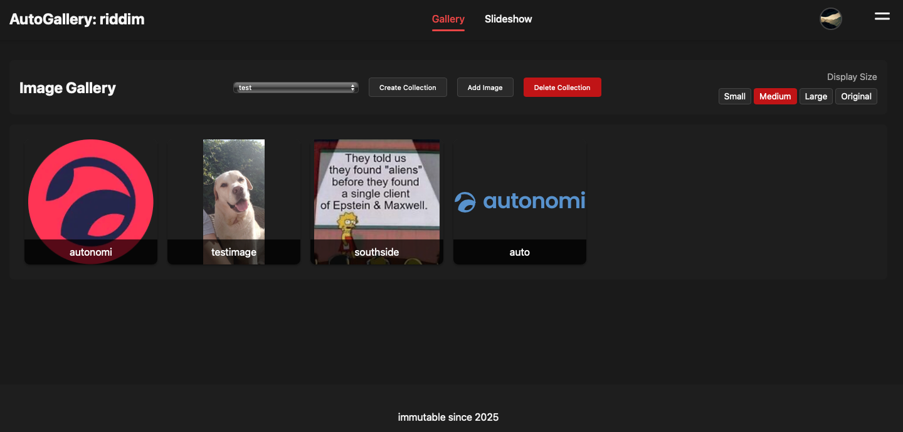
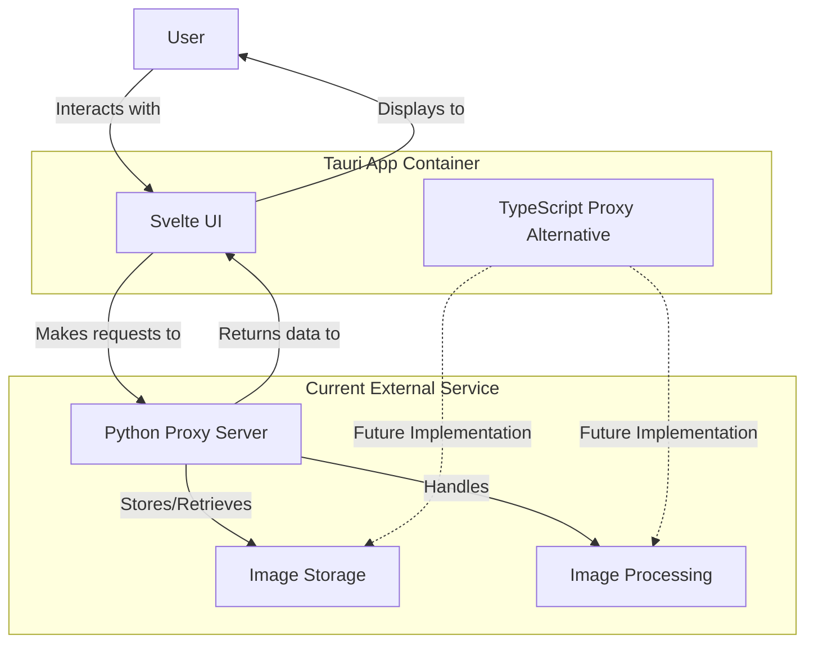

# AntGallery

## Impossible Futures Builders Program

---

## Overview

AntGallery is a simple image management application designed to provide users with a seamless way to organize, share, and view their digital collections.

Built with **Svelte + TypeScript** and complemented by a **Python proxy server**, AntGallery combines elegant design with powerful functionality.

---

## Current Implementation

---

## Current Features

- **Image Management**
  - Upload/download of pictures
  - Custom metadata support
  - Drag-and-drop reordering

- **Collection Organization**
  - Group images into collections
  - Collection management interface
  - Slideshow with customizable settings

- **User Experience**
  - Profile customization
  - Dark mode implementation

---

## Technical Architecture

- **Frontend**: Svelte + TypeScript
  - Modern reactive UI framework
  - Type-safe development
  - Component-based architecture

- **Backend**: Python proxy server
  - Handles API requests
  - Manages authentication
  - Processes images

- **Future Bundle**: Tauri application
  - Cross-platform compatibility
  - Reduced package size
  - ImageOcean containing all Images that were ever added ordered by Time (except for explicitly removed ones)
  - DeepSea (removed images - 2nd chance ... when images are removed here there is no other backup anymore)

---

## Communication Flow

---

## Technical Challenges

- **State Management**
  - Current glitches in complex state transitions
  - Inconsistent behavior across components

- **Animation & Transitions**
  - Not yet optimized for performance
  - Inconsistent across platforms

- **Known Bugs**
  - Occasional image loading issues
  - Profile data persistence challenges (state inconsitencies)

---

## Roadmap: Planned Features

- **User Experience**
  - Light mode theme option
  - Enhanced transitions and animations
  - Enhanced Slideshow-Mode
  - Comprehensive accessibility features
  - ImageOcean
  - DeepSea

- **Collaboration**
  - Collection sharing capabilities
  - Address book for friends/contacts
  - permission management
  - Modification access for collaborators

---

## Roadmap: Technical Improvements

- **Platform Support**
  - Tauri app bundling for:
    - Windows
    - macOS
    - Linux (x64 and ARM64)
    - mobile (we'll see about that - but i will try)

- **Backend Enhancement**
  - TypeScript proxy server implementation for Tauri
  - Credential/key management system
  - Proxy server optimizations
  - Codebase cleanup and refinement

---

## Open Source Commitment

- **GitHub Repository**
  - Frontend (Svelte + TypeScript)
  - Python proxy server
  - TypeScript proxy server (future)

- **MIT License**
  - Permissive licensing
  - Encourages collaboration
  - Allows commercial use

---

## The Vision

AntGallery aims to be more than just an image management tool—it's designed to be a comprehensive platform for visual content organization, sharing, and collaboration.

Our goal is to create a seamless experience that bridges the gap between personal collections and collaborative creative projects.

---

## Why Impossible Futures?

The Impossible Futures Builders Program provides the ideal environment to transform AntGallery from a promising concept to a transformative application. This can be one of many applicatins that will show the power of Autonomi. A simple yet very useful App that makes Image archiving and sharing (e.g. with a digital frame at your grandma) super easy. Just an old Flat-Screen, a RaspberryPi and AntGallery as startup application and grandma will be always smiling when she sees the newest pictures of her grandchildren.
No special hardware; no middlemen; no running costs.

We believe in building technology that empowers creativity and collaboration—values that align perfectly with the Impossible Futures ethos.

---

## Thank You

**Contact Information:**
- GitHub Repository: [github.com/rid-dim/antgallery](https://github.com/rid-dim/antgallery)

*AntGallery: Organize, Share, Inspire* 