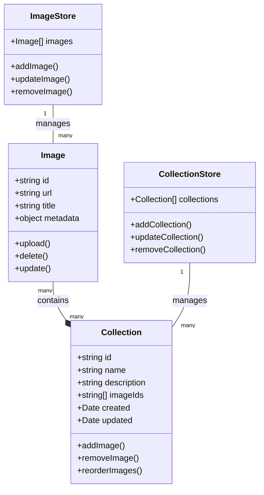
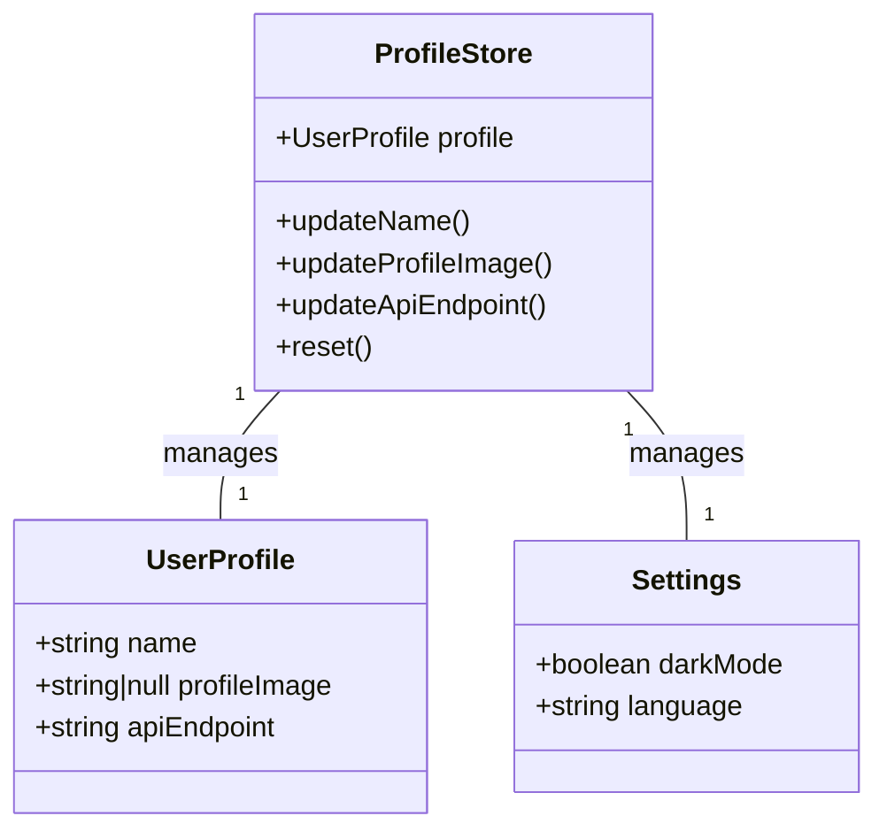
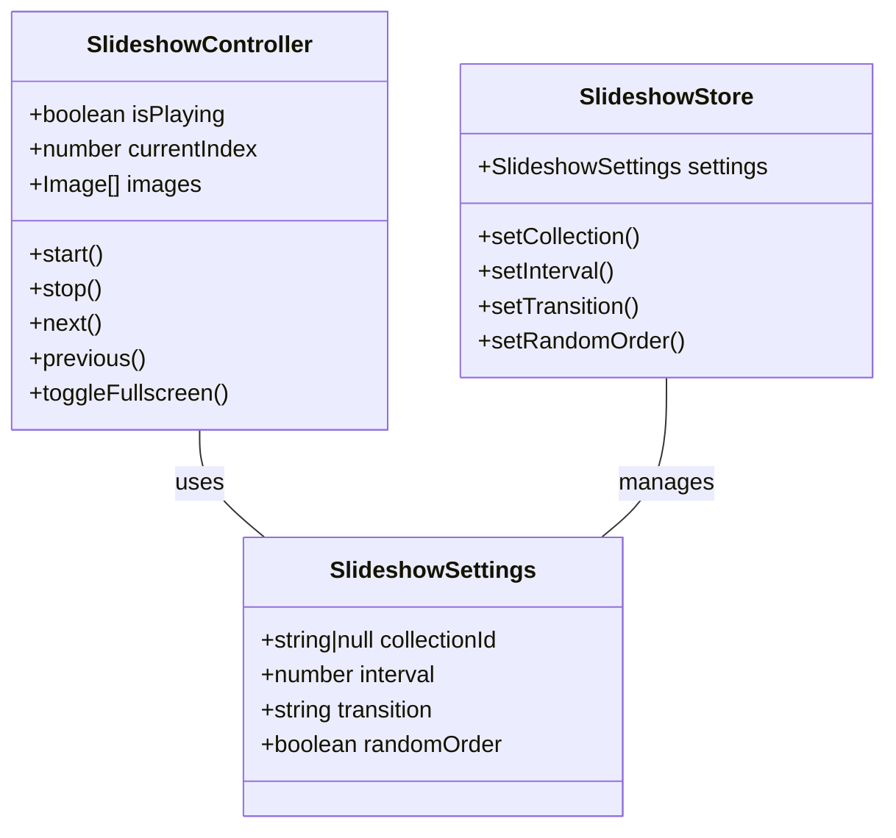

# AntGallery: Technical Overview

## Architecture

AntGallery implements a modern client-server architecture with a focus on user privacy, performance, and extensibility:

### Frontend (Svelte + TypeScript)

- **UI Framework**: Svelte with TypeScript for type safety
- **State Management**: Custom stores for reactive data flow
- **Routing**: SvelteKit page-based routing
- **Styling**: CSS with component-scoped styles
- **Internationalization**: Support for multiple languages (currently English and German)
- **Asset Handling**: Optimized image loading and processing

### Backend (Python Proxy Server)

- **API Gateway**: Handles all client requests
- **Authentication**: Secure token-based authentication
- **Image Processing**: Handles resizing, optimization, and metadata extraction
- **Storage Interface**: Abstraction layer for different storage backends
- **Security**: Input validation, request sanitization, and rate limiting

### Future TypeScript Proxy (for Tauri Integration)

- **Compatibility**: Full API compatibility with Python server
- **Native Integration**: Deep integration with Tauri capabilities
- **Performance**: Optimized for desktop environments
- **Local Storage**: Efficient local-first data management

## Data Flow

1. **User Interaction**: User interacts with the Svelte UI
2. **API Request**: Frontend makes a request to the proxy server
3. **Authentication**: Request is authenticated via tokens
4. **Processing**: Server processes the request (e.g., image upload, metadata update)
5. **Storage**: Data is stored in the appropriate backend
6. **Response**: Server sends response back to the client
7. **UI Update**: Frontend updates based on the response

## Key Components

### Image Management

### User Profile & Settings

### Slideshow Functionality

## Technical Details

### Frontend Implementation

- **Reactive UI**: Svelte's reactivity system for efficient updates
- **Component Structure**: Modular components for reusability
- **Store Pattern**: Custom stores for global state management
- **Lazy Loading**: Images loaded on-demand for performance
- **Drag-and-Drop**: Custom implementation for intuitive collection management
- **Form Handling**: Reactive forms with validation
- **Dark Mode**: System-wide theme support with persistence
- **Responsive Design**: Adapts to different screen sizes and orientations

### Proxy Server Implementation

- **RESTful API**: Standard HTTP methods for resource manipulation
- **JWT Authentication**: Secure token-based authentication
- **Image Optimization**: Automatic resizing and compression
- **Metadata Extraction**: EXIF and other metadata handling
- **Caching**: Efficient caching for improved performance
- **Error Handling**: Comprehensive error reporting and logging

### Tauri Integration (Planned)

- **Native File System**: Direct access to local files
- **Window Management**: Custom window handling and states
- **System Integration**: Notifications, clipboard access, etc.
- **Cross-Platform**: Consistent experience across operating systems
- **Updates**: Automatic application updates
- **Security**: Sandboxed runtime environment

## Development Workflow

1. **Planning**: Feature specification and architecture design
2. **Implementation**: Frontend and backend development
3. **Testing**: Unit tests, integration tests, and manual testing
4. **Deployment**: Release to target platforms
   - Web deployment
   - Desktop application packaging (Tauri)
5. **Maintenance**: Bug fixes and feature enhancements

## Performance Considerations

- **Image Optimization**: Server-side processing for optimal delivery
- **Lazy Loading**: Only load resources when needed
- **Client-Side Caching**: Reduce unnecessary network requests
- **Efficient State Management**: Minimize rerenders
- **Code Splitting**: Only load necessary JavaScript
- **Responsive Images**: Serve appropriate sizes for different devices

## Security Measures

- **Authentication**: Secure token-based system
- **Input Validation**: Thorough validation on both client and server
- **Content Security Policy**: Restrict resource loading
- **Permission Management**: Granular access control
- **Credential Storage**: Secure handling of sensitive information

## Future Improvements

- **TypeScript Proxy Server**: Complete rewrite of Python server in TypeScript
- **Offline Support**: Full functionality without internet connection
- **Collaboration Features**: Real-time editing and sharing
- **AI Integration**: Automated tagging and image recognition
- **Advanced Search**: Full-text search across metadata
- **Version History**: Track changes to collections over time
- **Encrypted Communication**: for Frontend/Backend-Communication ... just in case...

---

This document provides a technical foundation for understanding the AntGallery application architecture and implementation details. It will be updated as the project evolves. 